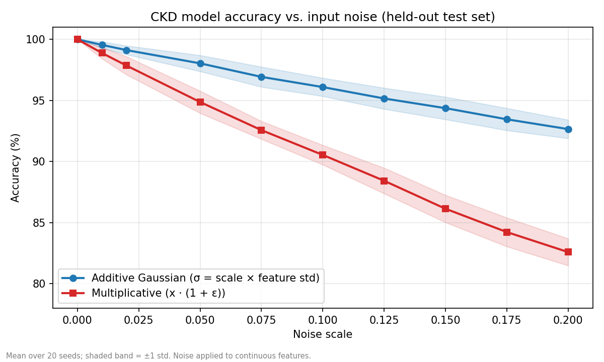

# CKD Prediction App (NephroCheck)

A multi-page Streamlit web application for predicting Chronic Kidney Disease (CKD) using clinically relevant
features such as GFR, BUN, Creatinine, Age, and comorbid conditions.

The system is powered by a tuned XGBoost classifier and focuses on both prediction and interpretability.

🔗 **Live App:** https://vinayak251104-ckd-prediction-app.streamlit.app/

> ⚠️ This project is for demonstration purposes only. It is not a medical diagnostic tool.

## Key Features

* Risk prediction based on user-provided clinical parameters
* Interactive data analysis using feature distribution visualizations
* Model explainability via SHAP-based feature attribution
* Model evaluation using confusion matrix and classification metrics
* Adjustable decision threshold to control sensitivity vs. specificity

## Dataset Overview

The dataset contains clinical measurements related to kidney function and associated health conditions.

* **Source:** Kaggle – Kidney Disease Risk Dataset
* **Total records:** 2304
* **Total columns:** 9 (8 input features + the `CKD_Status` target)
* **Note:** The CKD labels appear rule-generated rather than clinician-assigned (see below), so the data is
  treated as synthetic for evaluation purposes.

Input features:

* Glomerular Filtration Rate (GFR)
* Blood Urea Nitrogen (BUN)
* Creatinine Level
* Urine Output
* Age
* Diabetes, Hypertension, Dialysis status

## Model

An XGBoost classifier (1000 trees, learning rate 0.01, max depth 3, with subsampling and L1/L2
regularization), trained on an 80/20 train/test split (`random_state=101`).

## Model Performance & Robustness

### Validation accuracy

On the held-out test split, the model achieves 100% accuracy (221 non-CKD and 240 CKD cases all
classified correctly). Analysis of the dataset explains why: the CKD labels follow a clean threshold
pattern (roughly GFR < 60, BUN > 30, or creatinine > 2.5), and a depth-3 decision tree reproduces them
with 100% cross-validated accuracy. The perfect scores therefore show that the model learned this pattern.
They should **not** be read as real-world clinical accuracy.

Age, diabetes, hypertension and urine output carry almost no predictive signal in this dataset
(~50% single-feature accuracy, i.e. chance). The model relies mainly on GFR (~51% of feature importance),
BUN (~26%) and creatinine (~16%). `Dialysis_Needed` (~7%) is a downstream consequence of advanced CKD
rather than an independent predictor.

### Robustness to noise

To probe how the model behaves when inputs are imperfect, random noise was added to the continuous
features (Age, Creatinine, BUN, GFR, Urine Output) of the held-out test set at increasing noise scales.
Each result is the mean accuracy over 20 random seeds. Two kinds of noise were tested:

* **Additive noise:** each value is shifted by a random amount whose size depends on how spread out that
  feature is across the dataset.
  `noisy value = original + ε × (scale × feature std)`, where ε ~ N(0, 1).
  Every patient is nudged by a similar amount regardless of their value.
* **Multiplicative noise:** each value is shifted by a random amount proportional to its own size, which
  mimics a percentage measurement error.
  `noisy value = original × (1 + ε × scale)`, where ε ~ N(0, 1).
  At scale 0.1, a GFR of 70 is nudged by roughly ±7 and a GFR of 30 by roughly ±3.

| Noise scale | Additive | Multiplicative |
|---|---|---|
| 0.00 (clean) | 100.0% | 100.0% |
| 0.01 | 99.5% | 98.9% |
| 0.05 | 98.0% | 94.9% |
| 0.10 | 96.1% | 90.5% |
| 0.20 | 92.7% | 82.6% |



Accuracy declines smoothly as noise increases under both definitions, so performance degrades gracefully
rather than collapsing. It falls faster under multiplicative noise. The decline is consistent with
threshold-based labels: small perturbations push borderline patients across a cutoff and flip their
predicted label.

To reproduce the table and figure, run `python noise_evaluation/noise_robustness.py` from the repo root. The script loads the model and dataset from the root and saves the plot into `noise_evaluation/`.

### Limitations

Because the dataset appears to be synthetic, neither the validation accuracy nor the noise results say how the
model would perform on real patients. Validation on independent real-world data (for example, the UCI
Chronic Kidney Disease dataset) is needed before drawing conclusions about clinical performance.

## Run Locally

```bash
pip install -r requirements.txt
streamlit run Main.py
```

## Repository Structure

```
Main.py                              # Home page
pages/                               # About, Dataset Overview, Key Features, Analysis, Prediction
noise_evaluation/
  noise_robustness.py                # Robustness evaluation and figure generation
  noise_robustness.png               # Accuracy vs. noise plot
final_xg_model_for_ckd_status.pkl    # Trained XGBoost model
kidney_disease_dataset.csv           # Dataset
requirements.txt
LICENSE
```

## Tech Stack

Python, Streamlit, XGBoost, SHAP, scikit-learn, pandas, matplotlib, seaborn


